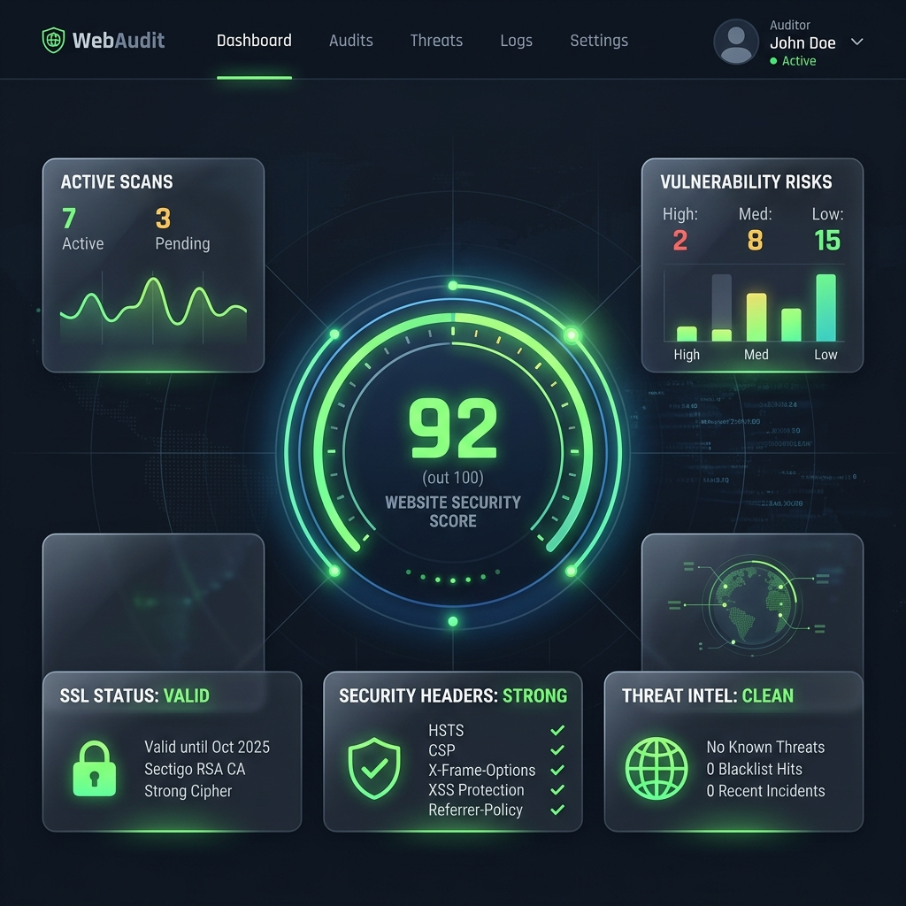

# Secure Website Checklist Auditor

A comprehensive enterprise-grade security auditing tool built with Node.js, Express, and Vanilla JS. It analyzes website headers, SSL configurations, DNS records, and integrates third-party threat intelligence to provide a weighted security score and actionable recommendations.



## Key Features

- **Deep Security Scanning**: Analyzes HSTS, CSP, X-Frame-Options, Cookies (Secure/HttpOnly), and more.
- **SSL/TLS Audit**: Verifies certificate validity, expiry, and issuer details.
- **DNS Analysis**: Checks for SPF and DMARC records to prevent spoofing.
- **Threat Intelligence**: Integrates VirusTotal (Domain) and AbuseIPDB (IP) reputation data.
- **Weighted Scoring**: Generates a 0-100 security score with High/Medium/Low risk ratings.
- **Persistence**: Local history of previous scans with JSON storage.
- **Exports**: Download audit reports as **JSON** or professional **PDF** files.
- **Premium UI**: Responsive dark theme with glassmorphism and animated loading states.

##  Project Structure

```text
├── engine/             # Scoring & Recommendation logic
├── intel/              # Threat Intel services (VT, AbuseIPDB)
├── public/             # Frontend (HTML, CSS, JS)
├── routes/             # API Endpoints
├── scanners/           # Specialized scanner modules
├── utils/              # Loggers, storage, PDF generators, etc.
├── logs/               # Application logs
├── data/               # Persistent JSON storage
├── app.js              # Express configuration
└── server.js           # Entry point
```

##  Setup & Installation

1.  **Clone the Repo**:
    ```bash
    git clone https://github.com/your-username/secure-website-checklist.git
    cd secure-website-checklist
    ```
2.  **Install Dependencies**:
    ```bash
    npm install
    ```
3.  **Environment Setup**:
    Create a `.env` file from `.env.example`:
    ```env
    PORT=3000
    VT_API_KEY=your_key
    ABUSEIPDB_API_KEY=your_key
    ```
4.  **Run Locally**:
    ```bash
    npm run dev
    ```

## Deployment Guide

### Render / Railway
1. Connect your GitHub repository.
2. Set **Build Command** to `npm install`.
3. Set **Start Command** to `npm start`.
4. Add environment variables (`VT_API_KEY`, etc.) in the dashboard.

### VPS (Ubuntu/Nginx)
1. Install Node.js and PM2.
2. Clone and install the app.
3. Start with: `pm2 start server.js --name secure-audit`.
4. Configure Nginx as a reverse proxy for port 3000.

## License
MIT License. Built for cybersecurity awareness and auditing.
